<details open>

<summary><span id="1-introduction" style="font-size: 2em; font-weight: 700;"><a href="#1-introduction">1. Introduction</a></span></summary>

<div align="center">
  <h1>
    
    Ecom
  </h1>
  <hr/>
  <p><strong>A Full-Stack MERN Application for Online Clothing Brands</strong></p>
  <p>
    
    
    
    
    
    
    

  </p>
  <p><strong>Live:</strong> <a href="https://github.com/SMKanzuleman/Ecom">E-Com</a></p>
</div>

<p>This repository contains the source code for E-Commerce Pro, a complete responsive e-commerce platform built with a React frontend and Node.js backend.The application includes product discovery, authentication, persistent cart management, customer and admin dashboards, order fulfillment, reviews, Cloudinary image uploads, and secure payment processing through Stripe.</p>

</details>

<details>
<summary><span id="2-features" style="font-size: 2em; font-weight: 700;"><a href="#2-features">2. Features</a></span></summary>

<ol>
  <li><strong>Multi-Provider Authentication</strong><br/>Secure email/password login and one-click Google OAuth 2.0 with JWT access and HTTP-only refresh tokens.</li>
  <li><strong>Instant Product Search</strong><br/>Debounced 300ms live search in the navbar with MongoDB regex querying across product names, categories, and descriptions.</li>
  <li><strong>Advanced Catalog Filtering</strong><br/>Multi-facet catalog filtering by categories, dual-thumb interactive price range sliders, color swatches, and dress styles.</li>
  <li><strong>Interactive Product Showcase</strong><br/>Dynamic image gallery with live variant selection, discount badge calculation, and stock limits.</li>
  <li><strong>Customer Reviews &amp; Ratings</strong><br/>Star-rating submission modal with sorting options and verified buyer feedback display.</li>
  <li><strong>Persistent Slide-Out Cart</strong><br/>Global sliding cart drawer supporting individual variant combinations, real-time quantity controls, and live subtotal updates.</li>
  <li><strong>Dual Payment &amp; Stripe Integration</strong><br/>Seamless checkout supporting Cash on Delivery and server-verified Stripe card payments with webhook order confirmation.</li>
  <li><strong>Real-Time Admin Analytics</strong><br/>Interactive KPI dashboard featuring revenue charts, conversion rates, order counts, and instant CSV export reports.</li>
  <li><strong>Full Inventory Studio</strong><br/>Complete product lifecycle manager with multi-image uploads, size pickers, hex color tags, and rich text descriptions.</li>
  <li><strong>Order Fulfillment Hub</strong><br/>Admin order tracker with live status updates and customer shipping details.</li>
  <li><strong>Visual Storefront Configurator</strong><br/>Dynamic admin tools to customize the homepage style showcase and configure footer contact details, brand bio, and social links.</li>
  <li><strong>Customer Self-Service Portal</strong><br/>User dashboard to monitor order timelines, manage shipping addresses, and securely update passwords.</li>
  <li><strong>Fluid Motion &amp; Micro-Interactions</strong><br/>Modern UI powered by Framer Motion with staggered page reveals, 3D card tilt physics, and tactile button feedback.</li>
</ol>
</details>

<details open>
<summary><span id="3-installation" style="font-size: 2em; font-weight: 700;"><a href="#3-installation">3. Installation</a></span></summary>

<br/>
<p><strong>1. Clone the repository and open the project folder:</strong></p>

```bash
git clone https://github.com/SMKanzuleman/Ecom
cd Ecom
```

<details open>
<summary><span id="31-backend" style="font-size: 1.25em; font-weight: 700;"><a href="#31-backend">3.1 Backend</a></span></summary>

<br/>
<p><strong>2. Install the backend dependencies:</strong></p>

```bash
cd BackEnd
npm install
```

<br/>
<p><strong>3. Create a `.env` file inside <code>BackEnd</code> and add your private environment values. Do not commit this file or publish its secrets.</strong></p>

Required variables:

```dotenv
PORT="Backend Port"
MONGOURL="Your MongoDB Atlas cluster URL or MongoDB Compass URL"
ACCESS_TOKEN_JWT_SECRET="Your access token secret"
ACCESS_TOKEN_EXPIRY="Access token expiry duration"
REFRESH_TOKEN_EXPIRY="Refresh token expiry duration"
REFRESH_TOKEN_JWT_SECRET="Your refresh token secret"
NODE_ENV="Application environment"
OAUTH_CLIENT_ID="Your Google OAuth client ID"
OAUTH_CLIENT_SECRET="Your Google OAuth client secret"
OAUTH_CALLBACK_URL="Your Google OAuth callback URL"
CLOUDINARY_CLOUD_NAME="Your Cloudinary cloud name"
CLOUDINARY_API_KEY="Your Cloudinary API key"
CLOUDINARY_API_SECRET="Your Cloudinary API secret"
RESEND_API_KEY="Your Resend API key"
STRIPE_SECRET_KEY="Your Stripe secret key"
CLIENT_URL="Your frontend URL"
```


<p><strong>4. Start the backend:</strong></p>

```bash
npm run dev
```

</details>

<details open>
<summary><span id="32-frontend" style="font-size: 1.25em; font-weight: 700;"><a href="#32-frontend">3.2 Frontend</a></span></summary>

<br/>
<p><strong>5. Open a new terminal, then install and start the frontend:</strong></p>

```bash
cd FrontEnd
npm install
npm run dev
```

</details>

</details>

<details>
<summary><span id="4-screenshots" style="font-size: 2em; font-weight: 700;"><a href="#4-screenshots">4. Screenshots</a></span></summary>

<details open>
<summary><span id="1-storefront" style="font-size: 1.25em; font-weight: 700; margin-left: 20px;"><a href="#1-storefront">1. Storefront</a></span></summary>

<table width="100%">
  <tr>
    <!-- LEFT SIDE: Full-height Home Page -->
    <td width="50%" align="center" valign="top">
      <div style="background: #1e1e24; color: #ffffff; padding: 6px 14px; border-radius: 20px; font-weight: 600; display: inline-block; font-size: 13px; letter-spacing: 0.5px; border: 1px solid #333;">
        Home Page
      </div>
      <br/><br/>
      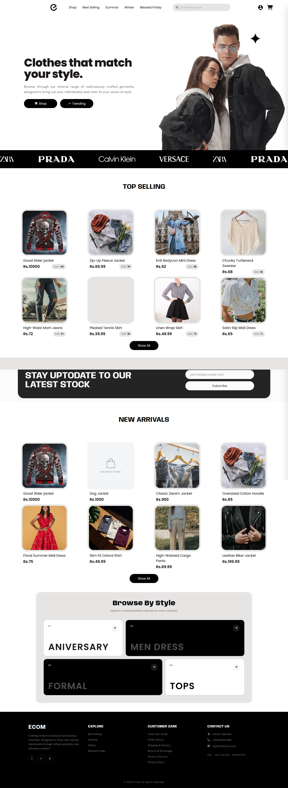
    </td>
    <!-- RIGHT SIDE: Shop + Product Detail -->
    <td width="50%" align="center" valign="top">
      <div style="background: #1e1e24; color: #ffffff; padding: 6px 14px; border-radius: 20px; font-weight: 600; display: inline-block; font-size: 13px; letter-spacing: 0.5px; border: 1px solid #333;">
        Shop Page
      </div>
      <br/><br/>
      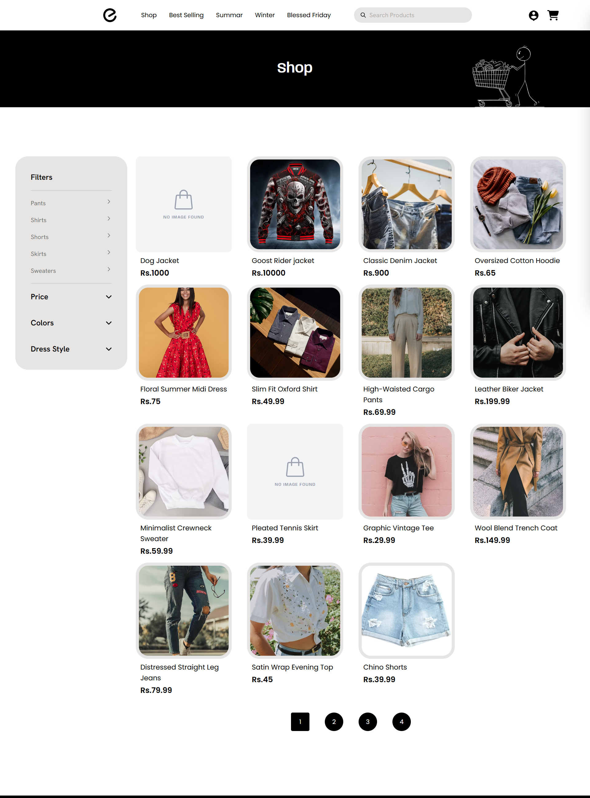
      <br/><br/>
      <div style="background: #1e1e24; color: #ffffff; padding: 6px 14px; border-radius: 20px; font-weight: 600; display: inline-block; font-size: 13px; letter-spacing: 0.5px; border: 1px solid #333;">
        Product Detail Page
      </div>
      <br/><br/>
      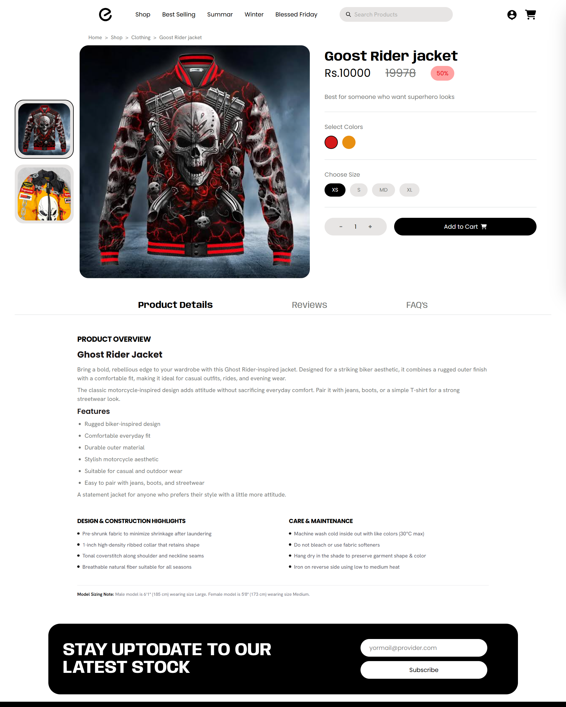
    </td>
  </tr>
</table>

<table width="100%">
  <tr>
    <td width="50%" align="center" valign="top">
      <div style="background: #1e1e24; color: #ffffff; padding: 6px 14px; border-radius: 20px; font-weight: 600; display: inline-block; font-size: 13px; letter-spacing: 0.5px; border: 1px solid #333;">
        Shopping Cart
      </div>
      <br/><br/>
      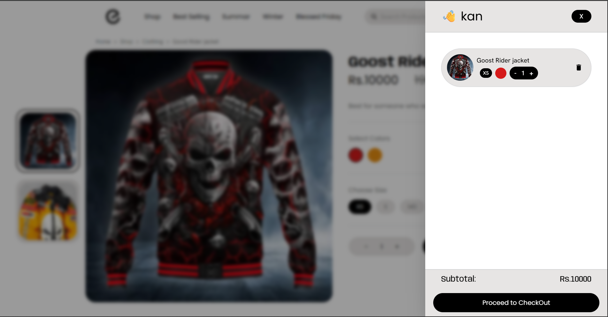
    </td>
    <td width="50%" align="center" valign="top">
      <div style="background: #1e1e24; color: #ffffff; padding: 6px 14px; border-radius: 20px; font-weight: 600; display: inline-block; font-size: 13px; letter-spacing: 0.5px; border: 1px solid #333;">
        Checkout
      </div>
      <br/><br/>
      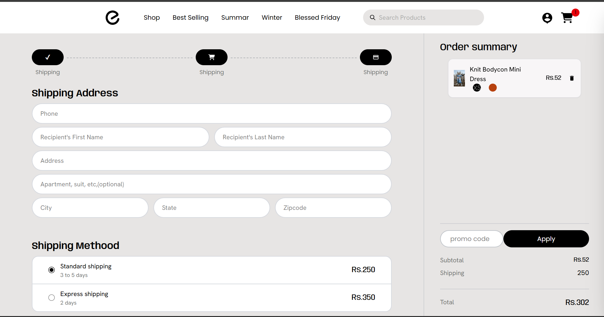
    </td>
  </tr>
    <tr>
    <td width="50%" align="center" valign="top">
      <div style="background: #1e1e24; color: #ffffff; padding: 6px 14px; border-radius: 20px; font-weight: 600; display: inline-block; font-size: 13px; letter-spacing: 0.5px; border: 1px solid #333;">
        Shopping Cart
      </div>
      <br/><br/>
      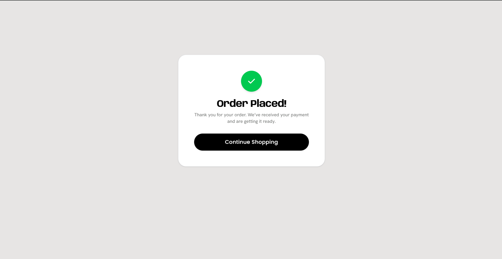
    </td>
    <td width="50%" align="center" valign="top">
      <div style="background: #1e1e24; color: #ffffff; padding: 6px 14px; border-radius: 20px; font-weight: 600; display: inline-block; font-size: 13px; letter-spacing: 0.5px; border: 1px solid #333;">
        Authentication
      </div>
      <br/><br/>
      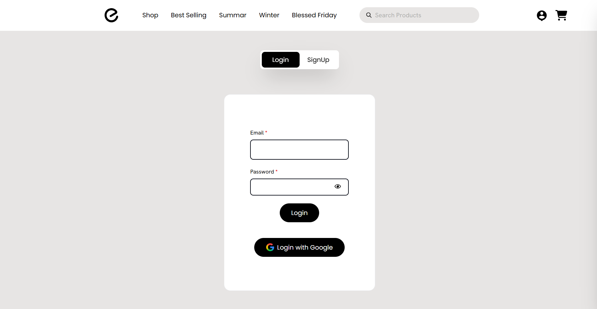
    </td>
  </tr>
</table>

</details>

<details open>
<summary><span id="2-admin-dashboard" style="font-size: 1.25em; font-weight: 700; margin-left: 20px;"><a href="#2-admin-dashboard">2. Admin Dashboard</a></span></summary>

<table width="100%">
<tr>
    <td width="50%" align="center" valign="top">
      <div style="background: #1e1e24; color: #ffffff; padding: 6px 14px; border-radius: 20px; font-weight: 600; display: inline-block; font-size: 13px; letter-spacing: 0.5px; border: 1px solid #333;">
        Dashboard Analytics
      </div>
      <br/><br/>
      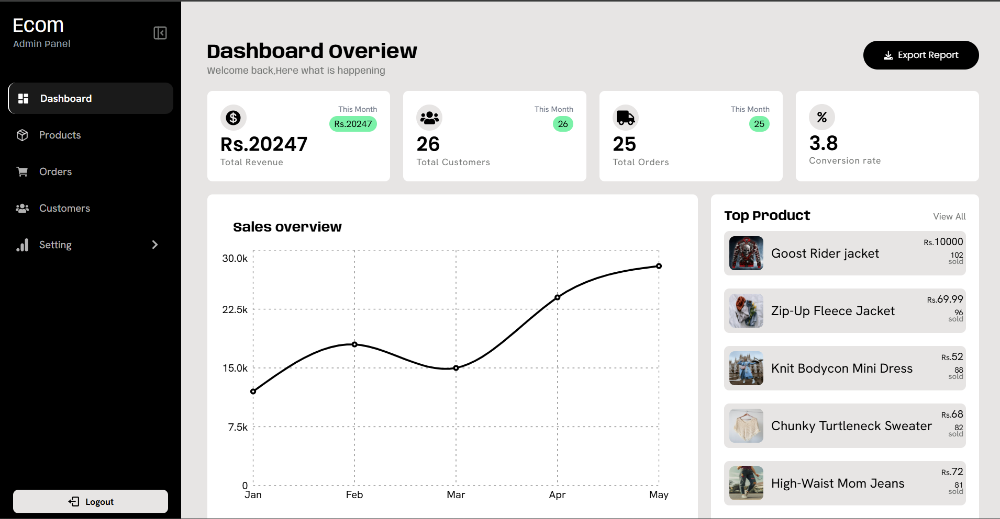
    </td>
    <td width="50%" align="center" valign="top">
      <div style="background: #1e1e24; color: #ffffff; padding: 6px 14px; border-radius: 20px; font-weight: 600; display: inline-block; font-size: 13px; letter-spacing: 0.5px; border: 1px solid #333;">
        Product Inventory
      </div>
      <br/><br/>
      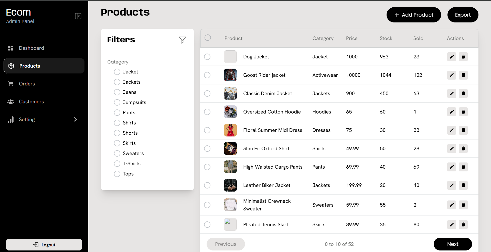
    </td>
  </tr>
  <tr>
    <td width="50%" align="center" valign="top">
      <div style="background: #1e1e24; color: #ffffff; padding: 6px 14px; border-radius: 20px; font-weight: 600; display: inline-block; font-size: 13px; letter-spacing: 0.5px; border: 1px solid #333;">
        Add New Product
      </div>
      <br/><br/>
      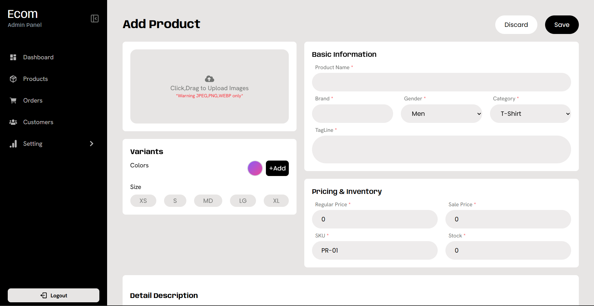
    </td>
    <td width="50%" align="center" valign="top">
      <div style="background: #1e1e24; color: #ffffff; padding: 6px 14px; border-radius: 20px; font-weight: 600; display: inline-block; font-size: 13px; letter-spacing: 0.5px; border: 1px solid #333;">
        Order Fulfillment
      </div>
      <br/><br/>
      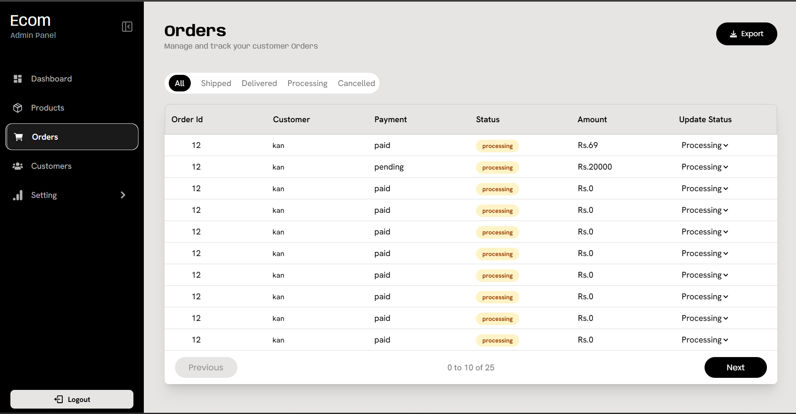
    </td>
  </tr>
  <tr>
    <td width="50%" align="center" valign="top">
      <div style="background: #1e1e24; color: #ffffff; padding: 6px 14px; border-radius: 20px; font-weight: 600; display: inline-block; font-size: 13px; letter-spacing: 0.5px; border: 1px solid #333;">
        Customers Management
      </div>
      <br/><br/>
      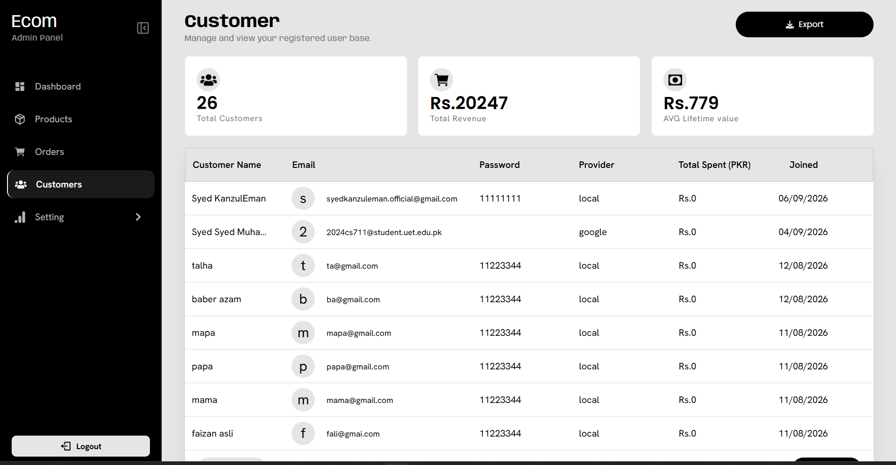
    </td>
    <td width="50%" align="center" valign="top">
      <div style="background: #1e1e24; color: #ffffff; padding: 6px 14px; border-radius: 20px; font-weight: 600; display: inline-block; font-size: 13px; letter-spacing: 0.5px; border: 1px solid #333;">
        Home Showcase Layout
      </div>
      <br/><br/>
      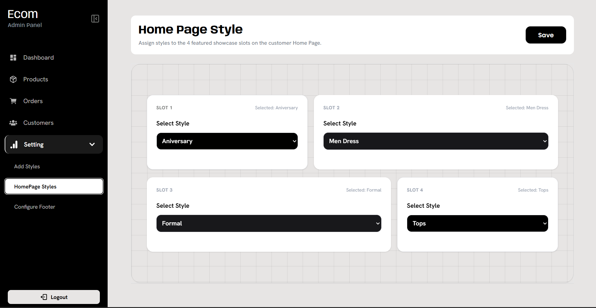
    </td>
  </tr>
  <tr>
    <td width="50%" align="center" valign="top">
      <div style="background: #1e1e24; color: #ffffff; padding: 6px 14px; border-radius: 20px; font-weight: 600; display: inline-block; font-size: 13px; letter-spacing: 0.5px; border: 1px solid #333;">
        Footer & Social Configurator
      </div>
      <br/><br/>
      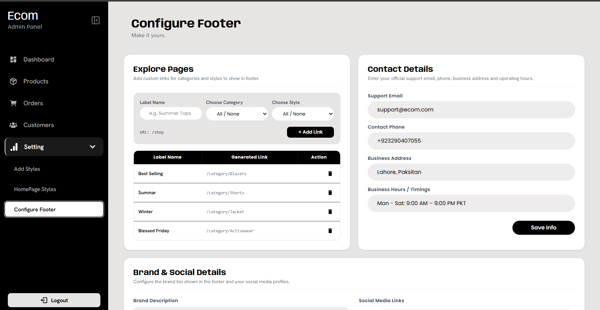
    </td>
     <td width="50%" align="center" valign="top">
      <div style="background: #1e1e24; color: #ffffff; padding: 6px 14px; border-radius: 20px; font-weight: 600; display: inline-block; font-size: 13px; letter-spacing: 0.5px; border: 1px solid #333;">
        Adding HomePage(Browse) Styles
      </div>
      <br/><br/>
      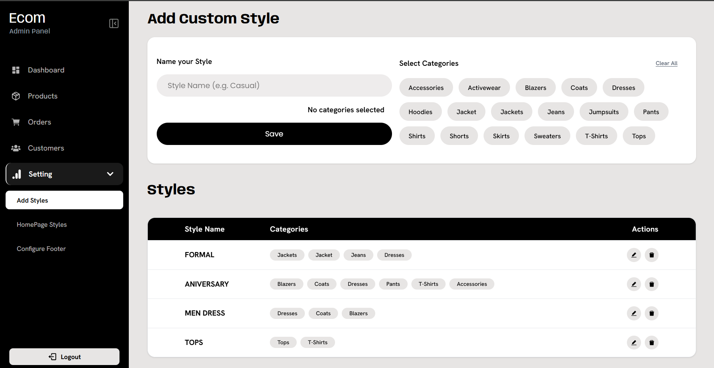
    </td>
  </tr>
 
  </tr>
</table>

<br/>

</details>

<details open>
<summary><span id="3-customer-dashboard" style="font-size: 1.25em; font-weight: 700; margin-left: 20px;"><a href="#3-customer-dashboard">3. Customer Dashboard</a></span></summary>

<table width="100%">
  <tr>
    <td width="50%" align="center" valign="top">
      <div style="background: #1e1e24; color: #ffffff; padding: 6px 14px; border-radius: 20px; font-weight: 600; display: inline-block; font-size: 13px; letter-spacing: 0.5px; border: 1px solid #333;">
        Account Overview
      </div>
      <br/><br/>
      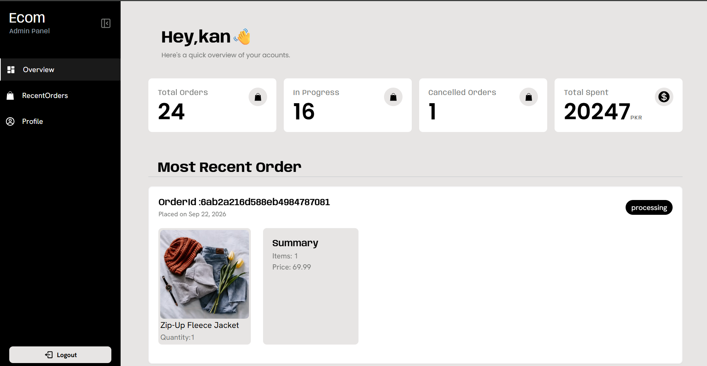
    </td>
    <td width="50%" align="center" valign="top">
      <div style="background: #1e1e24; color: #ffffff; padding: 6px 14px; border-radius: 20px; font-weight: 600; display: inline-block; font-size: 13px; letter-spacing: 0.5px; border: 1px solid #333;">
        Recent Orders
      </div>
      <br/><br/>
      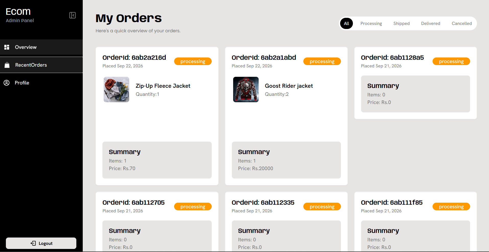
    </td>
  </tr>
  <tr>
    <td width="50%" align="center" valign="top">
      <div style="background: #1e1e24; color: #ffffff; padding: 6px 14px; border-radius: 20px; font-weight: 600; display: inline-block; font-size: 13px; letter-spacing: 0.5px; border: 1px solid #333;">
        Profile & Settings
      </div>
      <br/><br/>
      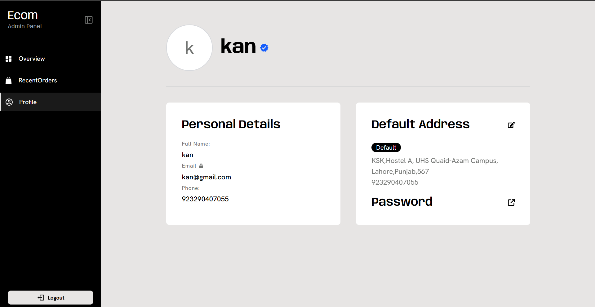
    </td>
  </tr>
</table>

</details>

</details>
