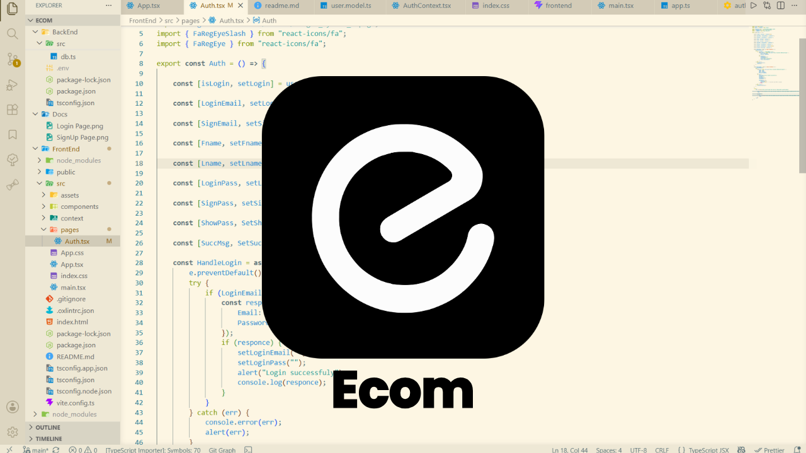
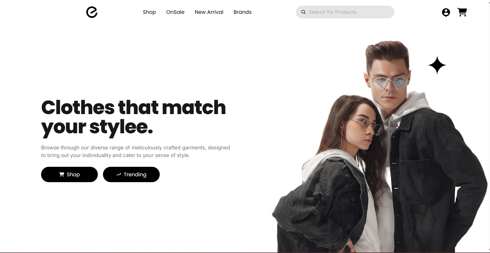

# Ecom

Ecom is a full-stack ecommerce application with a React storefront, an Express and TypeScript API, MongoDB persistence, role-based access control, product image uploads, and separate user and administrator dashboards.



## Contents

- [Features](#features)
- [Technology](#technology)
- [Project structure](#project-structure)
- [Prerequisites](#prerequisites)
- [Installation](#installation)
- [Environment variables](#environment-variables)
- [Running the application](#running-the-application)
- [Application routes](#application-routes)
- [API overview](#api-overview)
- [Authentication and roles](#authentication-and-roles)
- [Screenshots](#screenshots)
- [Production notes](#production-notes)
- [Contributing](#contributing)
- [License](#license)

## Features

### Storefront

- Homepage with hero content, brands, products, and sale information
- Product browsing, filtering, pagination, and product detail pages
- Shopping cart with quantity updates and item removal
- Checkout and order creation
- Product reviews
- Responsive React interface with toast notifications

### Accounts and security

- Email/password registration and login
- Google OAuth login
- Access and refresh token authentication
- Automatic access-token refresh in the frontend API client
- Logout, current-user lookup, forgot-password, OTP verification, and password reset flows
- Role-based authorization for `User` and `Admin` accounts

### User dashboard

- Account overview and profile information
- Recent orders and dashboard statistics
- Saved address management
- Password reset workflow

### Admin dashboard

- Product creation, editing, and deletion
- Product image uploads through Cloudinary
- Product and order management
- Customer listing
- Order status updates
- Sales and store statistics
- Store style management

## Technology

| Area | Technology |
| --- | --- |
| Frontend | React 19, TypeScript, Vite, React Router |
| Styling | Tailwind CSS 4 |
| Editor | Tiptap and TinyMCE integrations |
| Charts and UI | Recharts, React Icons, React Toastify |
| HTTP client | Axios |
| Backend | Node.js, Express 5, TypeScript, TSX |
| Database | MongoDB with Mongoose |
| Authentication | JWT, cookies, Google OAuth |
| Media and email | Cloudinary, Nodemailer, Resend |

## Project structure

```text
Ecom/
├── BackEnd/
│   └── src/
│       ├── admin/          # Admin dashboard handlers and routes
│       ├── auth/           # Registration, login, OAuth, tokens, password flows
│       ├── cart/           # Cart model, controller, and routes
│       ├── config/         # Environment-backed application configuration
│       ├── middlewares/    # Authentication, authorization, and uploads
│       ├── order/          # Order model, controller, and routes
│       ├── products/       # Products, styles, uploads, and filters
│       ├── reviews/        # Product review handlers and routes
│       ├── User/           # User dashboard handlers and routes
│       ├── app.ts          # Express app and route registration
│       └── db.ts           # MongoDB connection helper
├── FrontEnd/
│   └── src/
│       ├── components/     # Shared, user, and admin UI components
│       ├── context/        # Authentication and cart state
│       ├── Middlewares/    # Protected and admin route guards
│       ├── pages/          # Storefront, checkout, and dashboard pages
│       └── Utils/API.ts    # Axios client and token refresh interceptor
├── Docs/                   # README screenshots
└── package.json            # Root command for running both applications
```

## Prerequisites

- Node.js 20 or newer
- npm
- A MongoDB instance, local or hosted
- Cloudinary credentials for admin product image uploads
- Google OAuth credentials if Google sign-in is enabled
- A Resend API key if the email-based password flow is enabled

## Installation

Clone the repository and install dependencies in the root and both workspaces:

```bash
git clone https://github.com/SMKanzuleman/Ecom.git
cd Ecom
npm install
cd BackEnd && npm install
cd ../FrontEnd && npm install
cd ..
```

## Environment variables

Create `BackEnd/.env` with values appropriate for your environment:

```env
# The frontend API client currently targets port 2026.
PORT=2026
MONGOURL=mongodb://127.0.0.1:27017/ecom

NODE_ENV=development
JWT_SECRET=replace-with-a-long-random-access-secret
ACCESS_TOKEN_EXPIRY=10m
REFRESH_TOKEN_JWT_SECRET=replace-with-a-long-random-refresh-secret
REFRESH_TOKEN_EXPIRY=7d

OAUTH_CLIENT_ID=your-google-client-id
OAUTH_CLIENT_SECRET=your-google-client-secret
OAUTH_CALLBACK_URL=http://localhost:2026/auth/google/callback
RESEND_API_KEY=your-resend-api-key

CLOUDINARY_CLOUD_NAME=your-cloudinary-cloud-name
CLOUDINARY_API_KEY=your-cloudinary-api-key
CLOUDINARY_API_SECRET=your-cloudinary-api-secret
```

### Important local configuration detail

The backend falls back to port `3000`, but the frontend API client in `FrontEnd/src/Utils/API.ts` targets `http://localhost:2026`, and the backend CORS configuration allows `http://localhost:2024`. For the current code to work locally, use:

- Frontend: `http://localhost:2024`
- Backend: `http://localhost:2026`

Set `PORT=2026` in `BackEnd/.env`. If you choose another backend port, update the API base URL, refresh URL, Google OAuth redirect, and backend CORS origin as appropriate.

Never commit `.env` files or real credentials. The source currently contains fallback values for some settings; always provide strong environment-specific secrets outside local experiments.

## Running the application

From the repository root, start both applications:

```bash
npm run dev
```

Or run each application independently:

```bash
# Terminal 1: backend
cd BackEnd
npm run dev

# Terminal 2: frontend
cd FrontEnd
npm run dev
```

Open the storefront at [http://localhost:2024](http://localhost:2024). The backend health entry point is [http://localhost:2026](http://localhost:2026).

### Frontend commands

Run these from `FrontEnd/`:

```bash
npm run dev       # Start the Vite development server
npm run build     # Type-check and create a production build
npm run lint      # Run Oxlint
npm run preview   # Preview the production build locally
```

### Backend commands

Run these from `BackEnd/`:

```bash
npm run dev       # Start the TypeScript API with watch mode
npm test          # Placeholder; backend tests are not configured yet
```

## Application routes

| Path | Purpose | Access |
| --- | --- | --- |
| `/` | Storefront homepage | Public |
| `/shop` | Product catalogue | Public |
| `/product/:id` | Product details | Public |
| `/:type/:name` | Category or filtered product view | Public |
| `/cart` | Cart view | Public UI; cart actions require a user |
| `/checkout` | Checkout | Public UI; order creation requires a user |
| `/auth` | Login and registration | Public |
| `/userdashboard` | User dashboard | Authenticated user |
| `/password` | Password recovery/reset UI | Authenticated user flow |
| `/dashboard` | Admin dashboard | Admin only |

## API overview

The API is mounted at `http://localhost:2026` with the current local configuration.

| Resource | Endpoints | Access |
| --- | --- | --- |
| Auth | `POST /auth/register`, `POST /auth/login`, `GET /auth/google`, `GET /auth/me`, `POST /auth/refresh`, `POST /auth/logout`, password recovery endpoints | Mixed |
| Products | `GET /products`, `GET /products/:id`, `GET /products/FilterData` | Public reads |
| Products | `POST /products`, `PUT /products/:id`, `DELETE /products/:id`, `DELETE /products` | Admin |
| Cart | `GET /cart`, `POST /cart/:id`, `PUT /cart/:id`, `DELETE /cart/:id`, `DELETE /cart` | User |
| Orders | `POST /order`, `GET /order/userorders`, `PUT /order/cancel/:id` | User |
| Orders | `GET /order`, `PUT /order/:id` | Admin |
| Reviews | `GET /reviews/:productId`, `POST /reviews/:productId` | User |
| Admin | `GET /dashboard/AllUsers`, `GET /dashboard/Stats`, `GET /dashboard/Styles`, `POST /dashboard/Styles` | Admin |
| User | `GET /user/dashboard/stats`, `GET /user/dashboard/info`, `POST /user/dashboard/add/adress` | User |

Authenticated requests use cookies and/or the `Authorization: Bearer <token>` header. The frontend Axios client is configured with `withCredentials: true` and retries a failed request after refreshing an expired access token.

## Authentication and roles

- `User` accounts can manage their cart, place and cancel orders, view their dashboard, and write reviews.
- `Admin` accounts can manage products, customers, orders, styles, and store statistics.
- Protected backend routes use the authentication middleware first, followed by role authorization where required.
- For production, use HTTPS, secure cookie settings, strong secrets, restricted CORS origins, and an exact OAuth callback URL.

## Screenshots

| Login | Sign up |
| --- | --- |
|  |  |

| Homepage | Storefront preview |
| --- | --- |
|  |  |

## Production notes

- Replace every development secret and fallback credential with managed environment variables.
- Configure the frontend API base URL and backend CORS origin for the deployed domains.
- Use a hosted MongoDB deployment and verify its network access rules.
- Configure Cloudinary upload limits and production transformations before enabling admin uploads.
- Add automated backend tests and API validation before treating the application as production-ready.
- Run `npm run build` from `FrontEnd/` as part of deployment validation.

## Contributing

1. Create a feature branch.
2. Keep frontend and backend changes scoped to the relevant workspace.
3. Run `npm run build` and `npm run lint` from `FrontEnd/` before opening a pull request.
4. Document new environment variables, routes, or setup steps in this README.
5. Open a pull request with a concise description and screenshots for UI changes.

## License

This project is currently marked with the `ISC` license in the root `package.json`.
